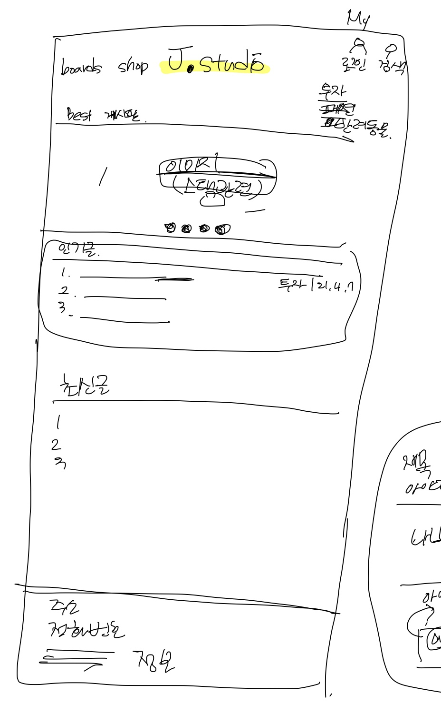
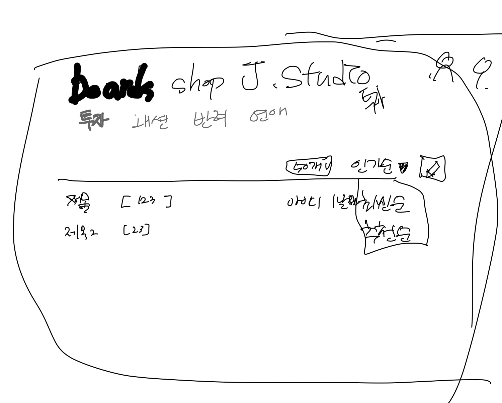
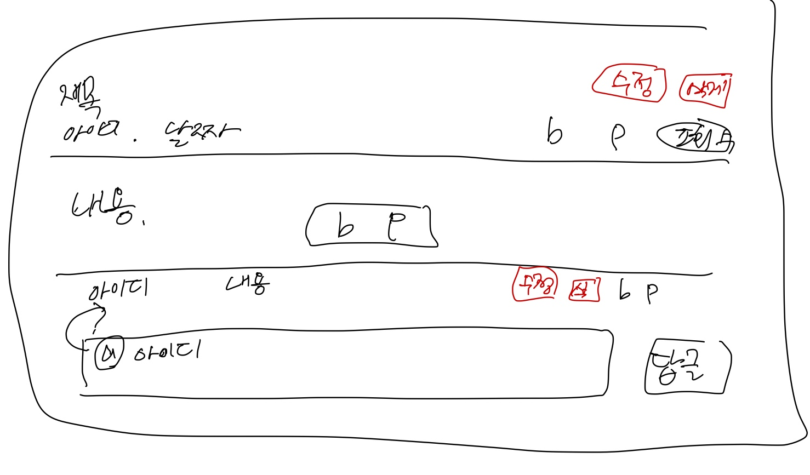

#시작하기

> # J.studio 
> ###J.studio는
>> + intelliJ
>> + Spring Boot
>> + Spting Framework
>> + Java 11
>> + gradle
> 
> 를 이용하여 제작할 웹사이트이며, 
> 게시판, 쇼핑몰을 구현할 예정이다. 
> ###게시판의 특별한 요소로
>> + OAuth2
>> + 무한댓글
>
>을 적용해볼 예정이다. 
>
> 2단계로는 리팩토링을 통해 
>> + 위지윅 에디터
>> + SSL인증
>
>을 적용해보기로 한다.  
> ###쇼핑몰은
>> + 각종API
>>   + 상품등록
>>   + 주문가져오기
>>   + 발주처리하기
>
>를 구현해보기로 한다. 
> 
> 쇼핑몰은 이외의 구체적 계획은 아직 없다. 
> 
> *~~네이버 스마트스토어는 API를 제공하지 않는것이 불편했던 기억이 있어 구현해보기로 했다.~~*

--------------------------

>##게시판 기획하기
> 게시판을 어떻게 제작할지 간단하게 계획을 세워보기로 한다.
>> ###메인화면
>> 
>>    
>> 상단좌측에는 boards, shop의 메뉴가 있다. 각각 drop-down으로 세부 메뉴를 볼 수 있다. 
>> 상단우측에는 로그인 버튼과 검색 버튼이 있다. 로그인 여부에 따라 My 버튼이 보여진다. 
>> 그 아래로는 이미지 슬라이드, 인기글, 최신글이 위치하고 있다. 
>> 하단에는 푸터로 각종 정보를 제공한다.
> -------------------
>> ###게시판
>> 
>>    
>> 게시판으로 들어왔을 때 화면이다.
> -------------------
>> ###게시글
>> 
>>    
>> 게시글을 조회할 때 화면이다. 
>> 댓글은 무한댓글로 구현될 예정이며, 프론트 이슈나 기타 이슈가 있을 경우 대대댓글 깊이가 제한 될 수 있다.
> -------------------
>> ###추가적으로
>> 추가적으로 게시글 작성 화면, 로그인화면, 개인정보 관리 화면 등등이 필요하다. 나머지는 그때 그때 디자인하기로 한다. 
> 
>

-------------------

Rmx
