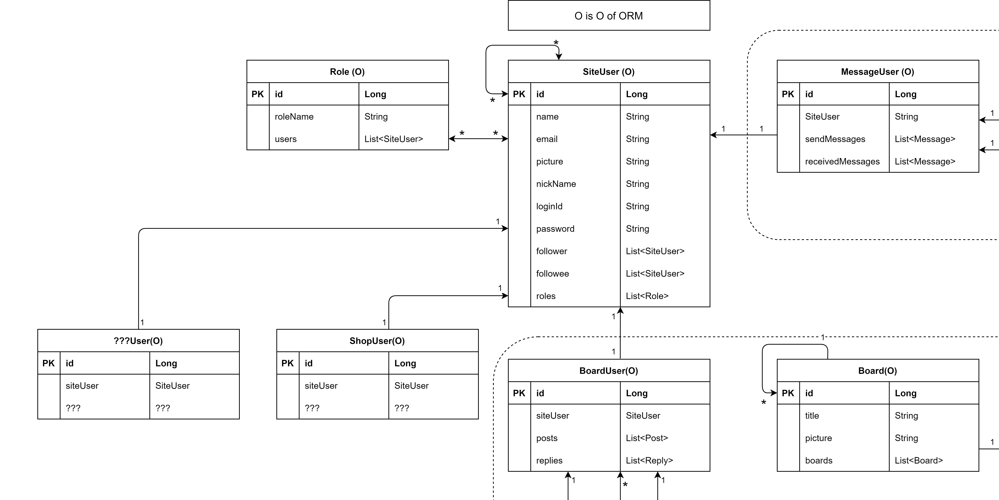
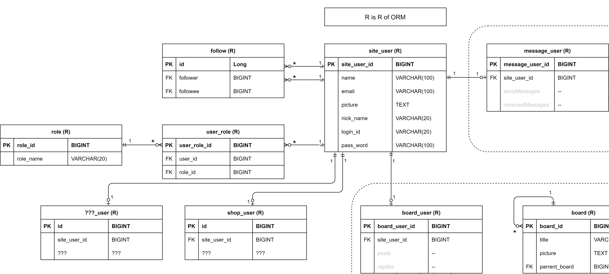
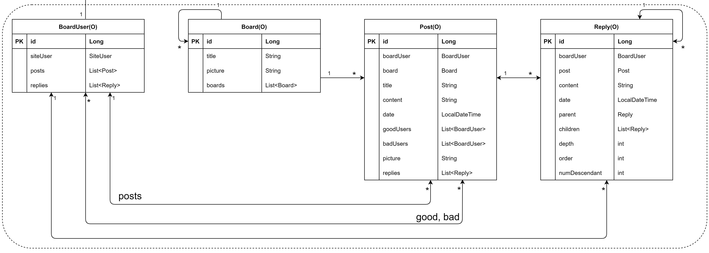
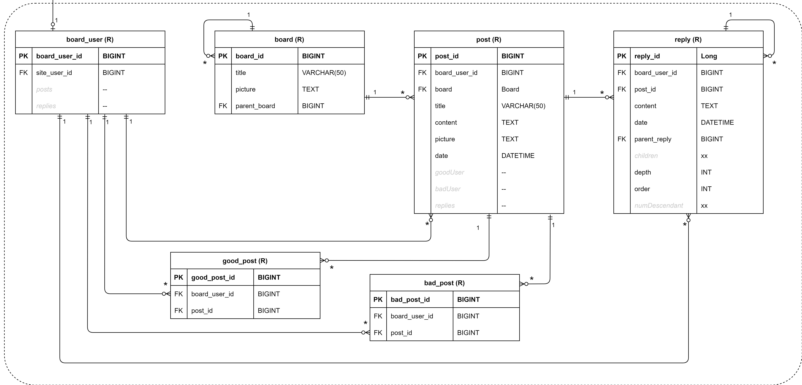

게시판

# Entity(엔티티) 기획하기

### 도메인 주도설계의 첫 걸음

-----------------

### 요소 종류 나열하기
우선 게시판을 구성하는 요소들을 나열해보겠습니다.

+ 유저
+ 게시판
+ 게시물
+ 댓글

이제 이 요소들이 서로 어떻게 얽히고 설키는지, 
서로 어떤관계, 영향을 주는지 고민해봐야 합니다.  

특히 유저가 어떤 행위를 할 수 있는지도 고민해서 
각 요소의 구성요소와 요소간의 관계를 설정해보겠습니다. 

*이하 아이패드와 draw.io를 활용하여 고민하고 정리한 결과입니다.*

-------------------------------

#### 전체

#### 유저

`유저의 객체  도표`

> 우선 유저는 확장성을 고려하여 SiteUser를 메인으로 기능별로 BoardUser, MessageUser, ShopUser, ???User로 나누었습니다. 관계는 1대 1의 관계가 됩니다. 각각 유저가 siteUser를 상속받고, single table에 저장하는 구성도 가능하지만, 구분성을 더 주기 위하여 각 유저가 siteUser를 필드로 가지는 방향으로 구성하였습니다.

> Role은 하나의 유저가 다양한 롤을 가질 수 있습니다. 당연히 다양한 유저가 같은 롤을 가질 수도 있습니다. 따라서 다대다의 관계가 됩니다.

> 또한 유저는 다수의 follower를 가질 수 있고, 다수의 followee를 가질 수 있습니다. 유저는 유저자신과 다대다 관계가 됩니다.

`유저의 데이터베이스 도표`

*자료형이 -- 인 것은 다른 테이블, 칼럼을 통해 구현되는 객체의 필드입니다.*

*자료형이 xx 인 것은 데이터베이스에서는 구현되지 않는 객체만의 필드입니다.*

> Role과 User의 다대다 관계는 user_role 테이블로 풀어냈습니다. user_role 테이블의 한 row마다 어떤 유저가 어떤 역할을 가지는지 표현 할 수 있습니다. 이것으로 객체의 siteUser가 List<Role>을 가지고, Role이 List<SiteUser>를 가질 수 있는 데이터베이스가 구성되었습니다.

> 다음으로 유저와 유저간의 다대다 관계 입니다. follow라는 테이블에 follower과 followee라는 column이 있고 한 row마다 누가 누구를 팔로우 하는지 알 수 있습니다.

#### 게시판

`게시판의 객체  도표`

> 게시판 유저는 포스팅을 할 수 있고, 댓글을 달 수 있습니다. 각각 1대 다 양방향 관계를 가집니다.

> 게시판 유저는 포스팅에 좋아요, 싫어요를 표현 할 수 있으며, 한 유저는 많은 글에 좋아요, 싫어요를 표현 할 수 있으며 한 글에는 많은 유저가 좋아요, 싫어요 할 수 있으므로 양방향 다대다 관계입니다.

> 게시판은 하위 게시판을 가질 수 있습니다. (마치 피라미드 처럼) 따라서 게시판은 게시판과 일방향 1대 다 관계를 가지게 됩니다. 양방향이 아닌 이유는 하위게시판은 상위게시판을 모르기 때문입니다.

> 게시판에는 수많은 게시글이 포스팅 됩니다. 게시판과 게시글은 `양방향` 1대 다 관계입니다. (도표 표기 오류)

> 댓글은 무한댓글로 구현될 예정입니다. parrent와 children을 통해 양방향 1대 다 관계를 가지고 있습니다.
>
> 참고로 다양한 알고리즘으로 구현해 보기 위해 필드는 넉넉히 잡아두었습니다.
>
> 자바에서 구현할 수도 있고, 동적쿼리를 통해 데이터베이스에서 구현할수도 있습니다.

`게시판의 데이터베이스 도표`

*자료형이 -- 인 것은 다른 테이블, 칼럼을 통해 구현되는 객체의 필드입니다.*

*자료형이 xx 인 것은 데이터베이스에서는 구현되지 않는 객체만의 필드입니다.*

> 게시판과 유저간의 좋아요, 싫어요로 생기는 양방향 다대다 관계는 good_post, bad_post 테이블로 풀어냈습니다.

> 상위게시판과 하위게시판의 1 대 다 관계는 parent_board column으로 구현되었습니다. parrent_board를 통해 나를 부모로 하는 게시판이 무엇인지 조회하여 객체의 <Board>boards를 구현할 수 있습니다.

> 같은 원리로 무한댓글의 상위 댓글과 하위 댓글의 양방향 1대 다 관계는 parent_reply column으로 구현되었습니다.

----------------------------------------------------------

Rmx
