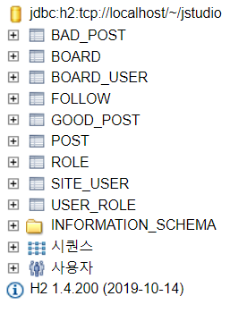
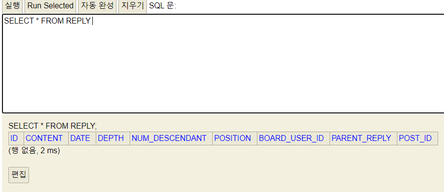
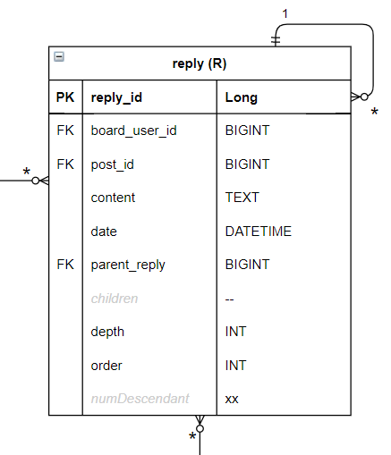

# Entity(엔티티) 객체 검증하기 - 1


----------------------------

### 엔티티 설계 수정

엔티티를 자바코드로 생성하다보니 사소하게 몇 가지 수정하였습니다.<br>자세한 내용은 readme/src/erd.drawio를 통해 확인할 수 있습니다.

---------------------------

### 자동생성을 통해 객체 코드 검증하기

하이버네이트는 테이블 자동생성 기능을 지원합니다. <br>해당 기능을 통해 검증해보고자 합니다.

*application.yml*

```yaml
spring:
    datasource:
        url: jdbc:h2:tcp://localhost/~/jstudio
        username: sa
        password:
        driver-class-name: org.h2.Driver
    jpa:
        hibernate:
            ddl-auto: create
        properties:
            hibernate:
                show_sql: true
                format_sql: true
```


> jpa.hibernate.dll-auto: 에서 ctrl+spacebar를 하게되면 옵션들과 각 옵션의 설명이 보입니다.<br>+ create : Create the schema and destroy previous data<br>create 옵션을 통해서 h2 db에 자동생성 시켜 보겠습니다.


-------------------------------------------------------------------
#### 자동생성된 테이블




> create옵션을 통해 자동으로 생성된 테이블을 확인할 수 있습니다.<br>그런데 reply 테이블이 보이지 않습니다.<br>show_sql, format_sql = true 이기에 콘솔을 통해 sql 로그를 볼 수 있습니다.<br>확인해보겠습니다.


#### reply 테이블은 어떤 문제가 있는걸까?

*콘솔 로그*

```sql
    CREATE TABLE REPLY (
       ID BIGINT NOT NULL,
        CONTENT VARCHAR(255),
        DATE TIMESTAMP,
        DEPTH INTEGER NOT NULL,
        NUM_DESCENDANT INTEGER NOT NULL,
        ORDER[*] INTEGER NOT NULL,
        BOARD_USER_ID BIGINT,
        PARENT_REPLY BIGINT,
        POST_ID BIGINT,
        PRIMARY KEY (ID)
    )"; expected "identifier"; SQL statement:
```

> reply테이블의 order 필드가 문제인것 같습니다.<br>order변수를 position으로 변경해보겠습니다.




> position으로 변경하니 문제 없이 생성되었습니다. 아마 db나 sql쪽의 예약어가 아닐까 예측됩니다.


#### 설계했던 ERD와 콘솔로그, 생성된 테이블 비교해보기



> ERD와 콘솔로그, 테이블을 비교해보면 전반적으로 잘 생성되었지만<br>*설계의도와 다른 몇가지를 발견할 수 있습니다.*
>
> 1. primary key는 id가 아니라 reply_id 이다.
> 2. numDescendant는 테이블에 생성되기 원치 않는다.
> 3. NOT NULL 설정하기
> 	+ 반드시 존재해야 하는 값이 있음 .
> 	+ 예를 들어 내용 없는 글은 작성 불가능 하게끔.
> 5. contet의 자료형 수정하기
> 	+ VARCHAR(255)로는 모자름
>
>
> 이렇게 세가지를 수정해보도록 하겠습니다.


#### 1. primary key 이름 수정하기

```java
@Entity
public class Reply {

    @Id
    @GeneratedValue
    @Column(name = "reply_id")
    Long id;
    ...(중략)
}
```

> @Column 어노테이션을 이용하면 다양한 설정을 할 수 있습니다.<br>그 중 하나로 Column명을 설정할 수 있습니다.


*이전*

```sql
Hibernate: 
    
    create table reply (
        id bigint not null,
        ...(중략)
        primary key (id)
    )
```

*이후*
```sql
Hibernate: 
    create table reply (
        reply_id bigint not null,
        ...(중략)
        primary key (reply_id)
    )
```


#### 2. 생성 제외하기

```java
@Entity
public class Reply {
    ...(중략)    
    //not on DB
    @Transient
    private int numDescendant;
}
```

> 필드에 @Transient 어노테이션을 붙혀주면,<br>persistence context의 관리대상에서 제외시킬 수 있습니다.


*이전*

```sql
Hibernate: 
    create table reply (
        ...(중략)
        depth integer not null,
        num_descendant integer not null,
        position integer not null,
        ...(중략)
    )
```

*이후*

```sql
Hibernate: 
    
    create table reply (
        ...(중략)
        depth integer not null,
        position integer not null,
        ...(중략)
    )
```


#### 3. nullable 설정하기

```java
@Entity
public class Post {
    ...(중략)
    @ManyToOne
    @JoinColumn(name = "board_id", nullable = false)
    private Board board;

    @Column(nullable = false)
    private String title;
    ...(중략)
}
```

>@JoinColumn과 Column에는 파라미터로 nullable이 있습니다.<br>기본적으로 true이며, NOT NULL이 필요하면 false로 설정해주면 됩니다.


*이전*

```sql
Hibernate: 
    
    create table post (
        ...(중략)
        title varchar(255),
        board_id bigint,
        ...(중략)
    )
```
*이후*

```sql
Hibernate: 
    
    create table post (
        ...(중략)
        title varchar(255) not null,
        board_id bigint not null,
        ...(중략)
    )
```


#### 4. 자료형 설정하기

```java
@Entity
public class Post {
    ...(중략)
    @Column(nullable = false, columnDefinition = "text")
    private String content;
    @Column(columnDefinition="text")
    private String picture;
    ...(중략)
}
```

> 자료형은 Column 어노테이션의 columnDefinition를 통해 설정할 수 있습니다.


*이전*

```sql
Hibernate: 
    
    create table post (
	    ...(중략)
        content varchar(255) not null,
        picture varchar(255),
	    ...(중략)
    )
```
*이후*

```sql
Hibernate: 
    
    create table post (
	    ...(중략)
        content text not null,
        picture text,
	    ...(중략)
    )
```


--------------------------------------------

> 스프링 JPA를 활용해서 설계한 엔티티를 자바에서 구현하고, 검증해보았습니다.<br>구현하고 검증하는 과정에서 발견된 오류들은 ERD에도 업로드 하였습니다.
>
> 자세한 내용은 readme/src/erd.drawio를 통해 확인할 수 있습니다.

---------------------------------------------------------

Rmx
