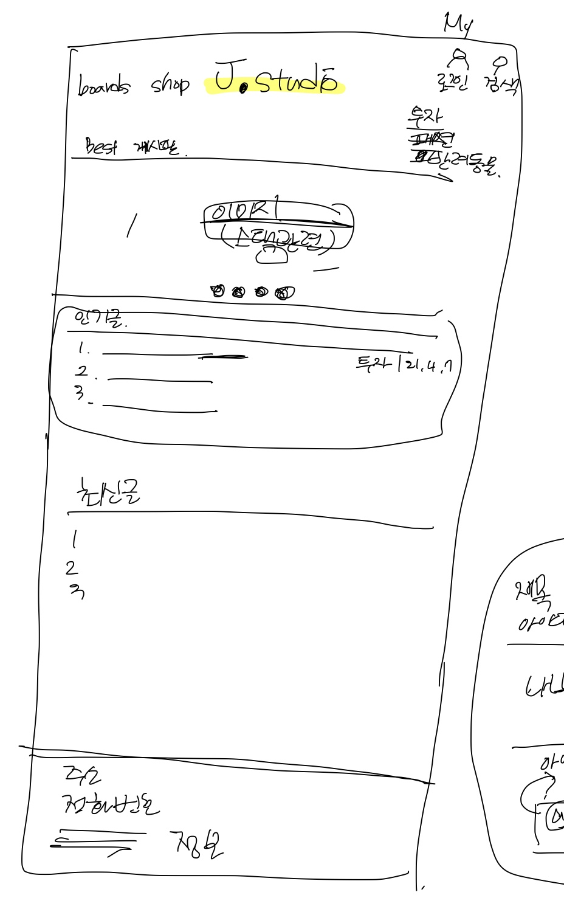
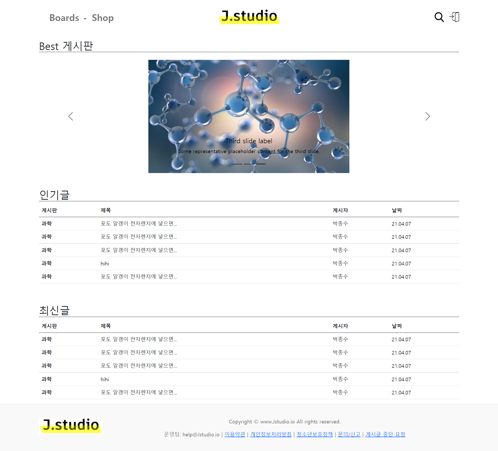
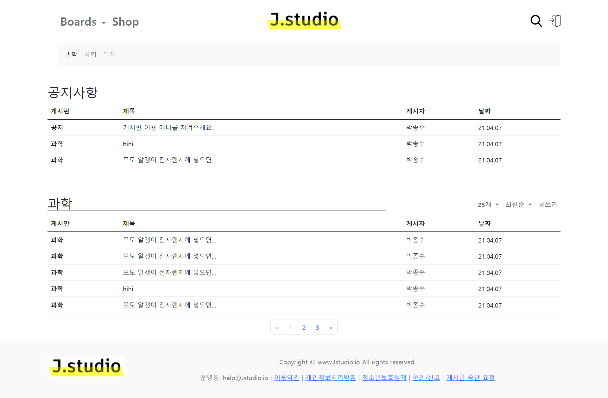
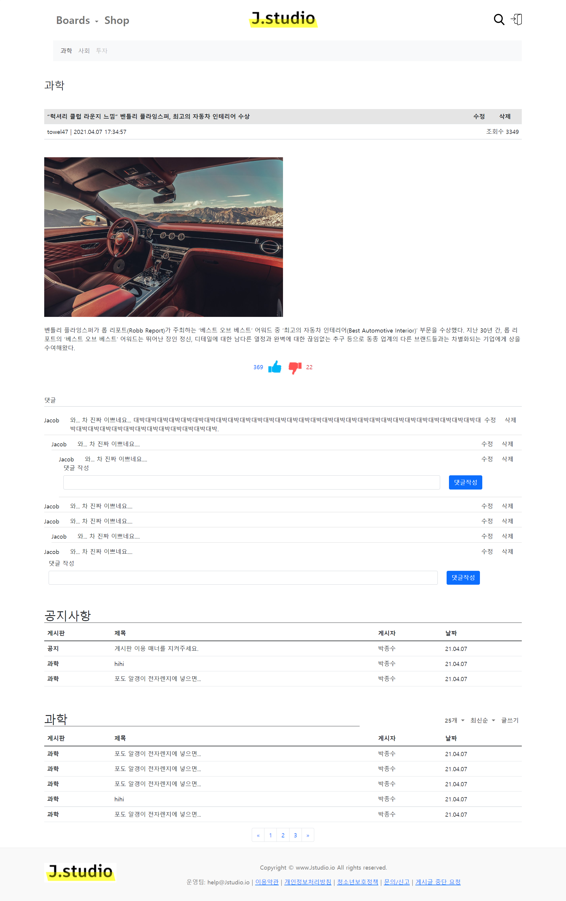
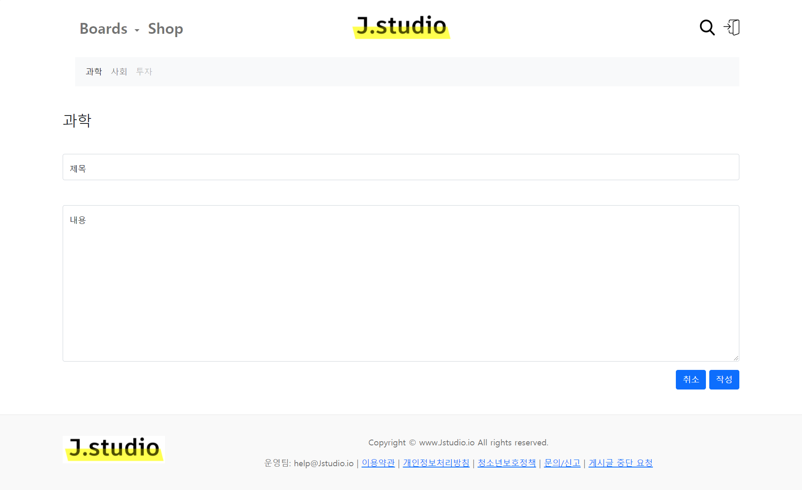
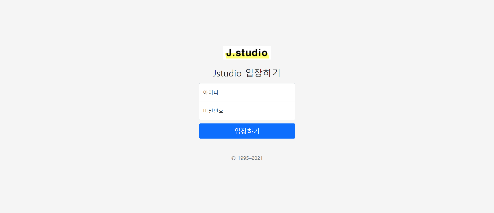

# 프론트 구현하기

------------------------------------

> 뒤에서 부터 기능을 구현하면서 만들 수 도 있지만, 앞에서 부터 만들고 기능을 채워넣는 순서로 만들어 보겠습니다.

> 프론트는 서버 사이드 렌더링(SSR)을 제공하는 **thymeleaf**와 CSS, JS 프레임워크인 **BootStrap**을 활용하겠습니다.

### 메인 페이지 만들기

----

> bootstrap에서 제공하는 [예시들](https://getbootstrap.com/docs/5.0/examples/)를  보고 우리 프로젝트와 유사한 예시들을 골라줍니다.
>
> + [blog 예시](https://getbootstrap.com/docs/5.0/examples/blog/)
> + [carousel 예시](https://getbootstrap.com/docs/5.0/examples/carousel/)

> [Docs](https://getbootstrap.com/docs/5.0)를 보고 검색을 활용해서 필요한 요소들을 적절히 배치해줍니다.
>
> + [grid](https://getbootstrap.com/docs/5.0/layout/grid/)
> + [tables](https://getbootstrap.com/docs/5.0/content/tables/)
> + [navbar](https://getbootstrap.com/docs/5.0/components/navbar/)
> + [carousel](https://getbootstrap.com/docs/5.0/components/carousel/)
> + [pagination](https://getbootstrap.com/docs/5.0/components/pagination/)

### 구현된 메인페이지

--------------------------------

> 나머지도 같은 방법으로 구현해줍니다.

### 게시판

### 게시글

### 게시글 작성

### 로그인

